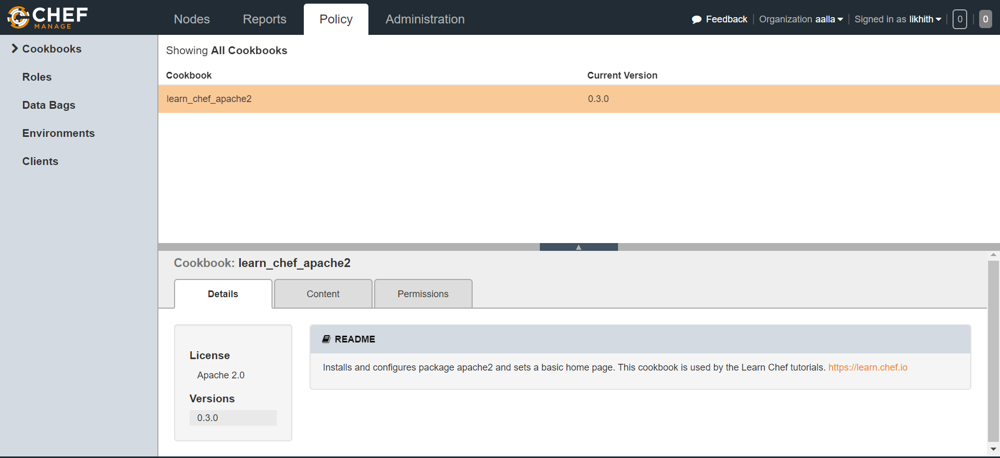

# chef_apache2
This project illustrates a Chef package setup on a Ubuntu system and a basic chef cookbook for the configuration setup of apache2 server

This repo includes the following steps:  
- ` Created a recipe that holds more than one resource ` 
- ` Installed the package ` 
- `setup the service and initiates with html home page`
- `Bundled it into a cookbook and moved the dependecy` 
- `created a template out of it` 

- This cookbook is also been uploaded to the chef server at https://manage.chef.io to manage the node.

The node communicates the chef server and maintains the configuration.
